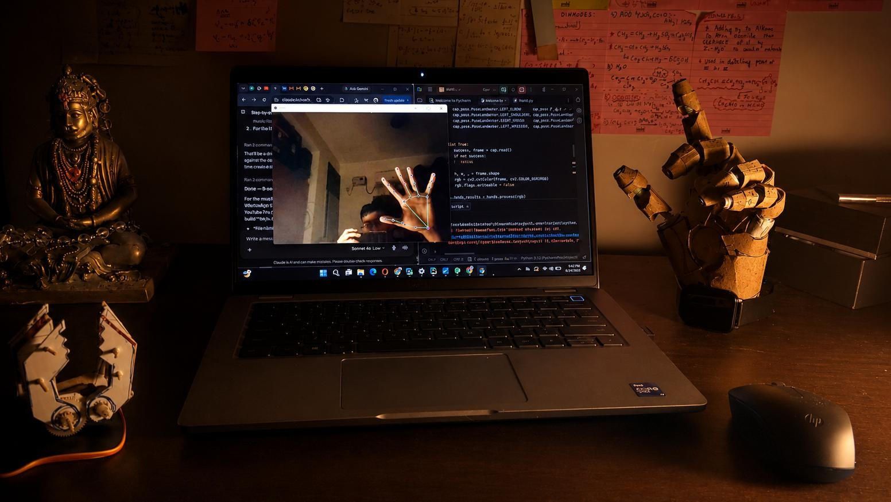
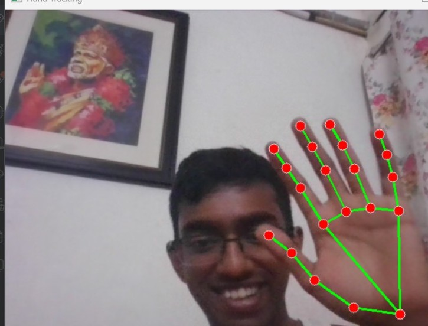
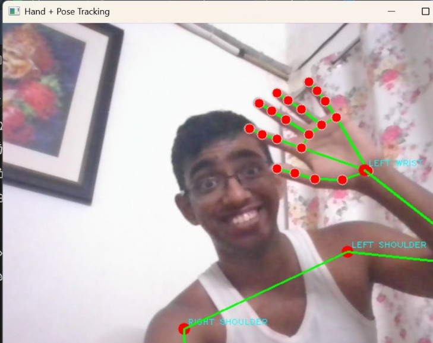
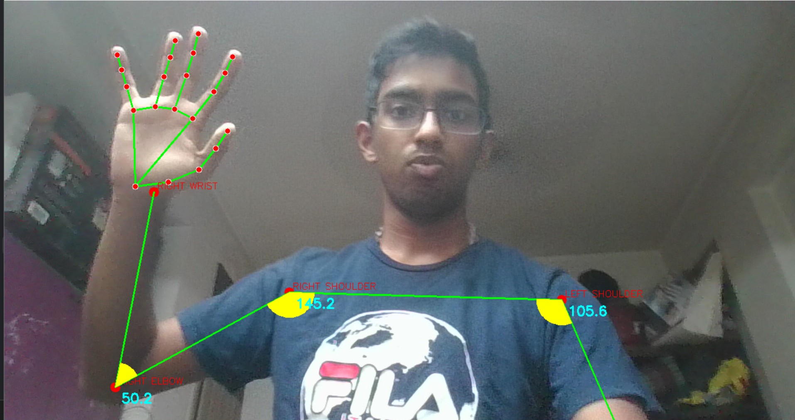
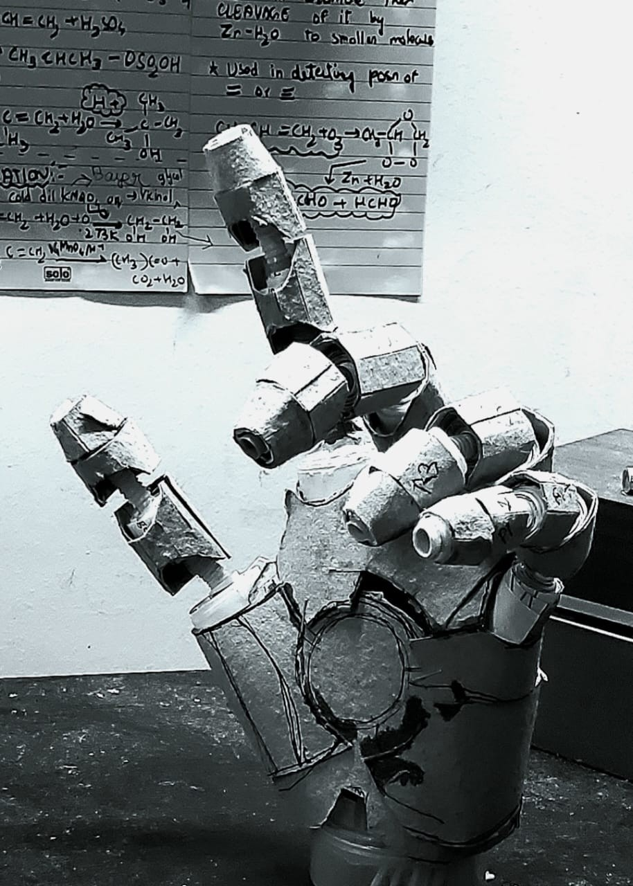

# HUMANOID_HAND 🦾

**A vision-controlled humanoid robotic hand that mirrors human hand movement in real time.**

A camera watches my hand, computer vision tracks the finger and arm joints, Python computes the joint angles, and an Arduino + servo array drives a physical hand to copy the motion. Built from scratch — including the hand itself, hand-fabricated from paper, card, and hinges.



---

## What it does

This project turns a webcam into a controller for a physical robotic hand. The pipeline is:

**See → Think → Act**

1. **See** — a webcam feeds video into Python.
2. **Think** — [MediaPipe](https://developers.google.com/mediapipe) and OpenCV detect 21 hand landmarks (and full-body pose), and the code converts those landmark positions into finger/joint angles.
3. **Act** — the angles are streamed over serial to an Arduino, which drives the servos so the physical hand mirrors my real hand.

---

## The journey

This wasn't built in one go. It grew in stages — software first, then hardware, then better hardware.

### 1. Learning computer vision (OpenCV)

Started by learning the basics of image processing in OpenCV — colour spaces, thresholding and segmentation — to understand how a computer "sees" before tracking anything.


### 2. Real-time hand tracking (MediaPipe)

Next, real-time detection of the 21 hand landmarks on a live webcam feed. This is the core of the whole project — every fingertip and knuckle is located frame by frame.



### 3. Hand + full-body pose tracking

Extended the tracking to include body pose — wrist, elbows and shoulders — so the system understands the whole arm, not just the hand.



### 4. Computing real joint angles

With the landmarks tracked, the next step was the actual maths: calculating the **angle at each joint** from the landmark geometry — elbow and shoulder angles drawn live as yellow arcs (e.g. elbow 50.2°, shoulders 145.2° and 105.6°). These angles are exactly what gets mapped to servo positions, so this is the bridge between "seeing" and "moving".



### 5. First physical hand — straw joints

The first physical build of the hand, fabricated by hand from paper and card, using drinking straws as the first version of the finger joints.



### 6. Upgraded hand — hinged joints (Spider-Man sign 🕷️)

The straw joints were then replaced with proper **hinges** for stronger, more reliable finger articulation — shown here holding the Spider-Man sign. This is the version in the hero image at the top.

> 🎥 **Demo videos** of the hand moving are included in the `media/` folder.

---

## Hardware

| Part | Role |
|------|------|
| Webcam | Captures the live video of the hand |
| Arduino Mega | Receives angle data and drives the servos |
| PCA9685 16-channel driver | Expands the Arduino to control many servos over I²C |
| MG996R / MG90S / SG90 servos | The "muscles" — one set per finger + wrist |
| Hand-fabricated frame | Paper / card fingers with hinged joints |
| 12V external supply | Powers the servos (shared ground with Arduino) |

## Software

| Tool | Role |
|------|------|
| Python | Runs the vision pipeline on the PC |
| OpenCV | Image capture and processing |
| MediaPipe | Hand + pose landmark detection |
| PySerial | Sends joint angles to the Arduino |
| Arduino (C++) | Reads angles and writes them to the servos |

---

## How it works (the pipeline)

```
 Webcam ──► Python (OpenCV + MediaPipe) ──► joint-angle math
                                                  │
                                                  ▼
                              PySerial sends "a0,a1,a2,...\n"
                                                  │
                                                  ▼
                    Arduino Mega ──► PCA9685 ──► servos ──► the hand moves
```

The Python side computes each finger's bend angle from the landmark geometry, packs the angles into a comma-separated line, and sends it down the USB serial port. The Arduino reads each line, splits the values, and writes each one to its matching servo channel.

---

## Repository structure

```
HUMANOID_HAND/
├── README.md
├── images/                 # build + tracking screenshots
├── media/                  # demo videos
├── python/
│   └── hand_tracker.py     # vision pipeline (PC side)
└── arduino/
    └── servo_receiver.ino  # servo driver (Arduino side)
```

---

## About

Built by **Jeggachakravarthy** while self-teaching Python, OpenCV, MediaPipe and Arduino — as the first step toward a career in **humanoid robotics and embodied AI**.

*This is an active, evolving project. Next steps: smoother angle mapping, dual-arm control, and a sturdier 3D-printed frame.*
